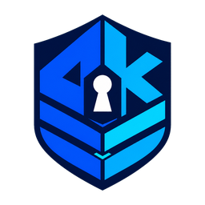
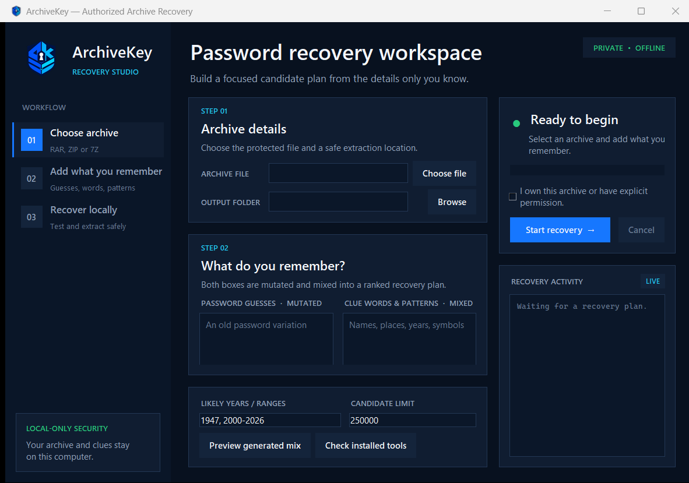

<p align="center">
  
</p>

<h1 align="center">ArchiveKey Recovery</h1>

<p align="center"><strong>Private, focused archive recovery for Windows.</strong></p>

ArchiveKey is a local Windows desktop application for recovering passwords from archives that you own or are explicitly authorized to access. It creates probability-ranked candidates from remembered words, names, places, dates, acronyms, separators, numeric tokens, and trailing symbols. Recovered archives are verified and extracted to a new folder; the original archive is never changed.

For RAR 5, ArchiveKey includes its own independent parser and PBKDF2-HMAC-SHA256 password verifier. It does not require John the Ripper for RAR 5 candidate testing. UnRAR or 7-Zip is used only to perform final archive verification and safe extraction after ArchiveKey finds a matching password.



## Important limitation

Strong encryption has no universal bypass. Recovery succeeds only if the password falls inside the tested candidate space. Good clues and approximate password structure matter far more than a huge generic password list.

## Candidate mathematics

ArchiveKey treats recovery as an ordered probability problem rather than an alphabetical brute-force problem. Each candidate receives a relative cost:

```text
cost = base_cost + template_cost
     + log2(number_rank + 2)
     + log2(separator_rank + 2)
     + log2(symbol_rank + 2)
```

Lower-cost candidates are tested first. Direct clues have the lowest base cost, derived acronyms have a small additional cost, and less common components receive gradually larger logarithmic costs. A few user-supplied possible password guesses are tested first.

For example, the synthetic clue `United Kingdom` produces direct case variants plus the contextual aliases `UK` and `GB`. The grammar then constructs and scores:

```text
UK
UK@123
UK@123!
UK@123%
123@UK
...
```

Synthetic regression fixtures verify that high-probability structured candidates are reached early. An unrestricted nine-character printable-ASCII search would contain hundreds of quadrillions of candidates.

The concept-lattice weave uses only seeds explicitly categorized for pairing.
For every unordered concept pair it evaluates both starting directions, alternates
characters, consumes a shared next character once, and ranks the bounded result
ahead of low-value generic mutations. This adds compound-word coverage without
performing an unrestricted Cartesian product over every downloaded seed.

## Current MVP features

- Native RAR 5 header and file-encryption record parsing
- Native RAR 5 PBKDF2-HMAC-SHA256 verification
- Direct testing of uncertain password guesses before generated combinations
- Adaptive mutation of guesses across case, numbers, separators, endings, and bounded leetspeak
- Two-way mixing of guess-derived stems with remembered clue words and patterns
- Shared-character interleaving of two remembered concepts, including both starting directions
- No-hint concept-lattice weaving across categorized public geographic seeds
- In-app generated-plan preview with strategy counts and example candidates
- Opt-in GitHub community seed pack for recovery without personal hints
- Explicit offline/online-pack status with local caching and no archive upload
- Probability-scored password grammar without leaked-password lists
- Country/place aliases and acronym generation
- `stem + separator + number + trailing symbol` rules using synthetic fixtures
- Bounded repeated-symbol rules such as `BlueRiver@123@@` and `Word#2042!!!`
- Configurable years and candidate limits
- Parallel CPU verification with live rate and completion estimates
- Password verification before extraction
- Safe extraction to a new, uniquely named folder
- Background recovery, cancellation, and logs
- Branded dark recovery workspace with live status and activity panels
- Explicit ownership/authorization confirmation
- Optional legacy John backend for older RAR/ZIP formats
- 7z verification/extraction when 7-Zip is installed (native 7z recovery is planned)

## Requirements

- Windows 10 or 11
- Python 3.11 or newer (Tkinter included)
- WinRAR/UnRAR for RAR verification and extraction, or 7-Zip for ZIP/7z

John the Ripper jumbo is optional and is used only as a compatibility backend for formats that ArchiveKey does not yet verify natively.

ArchiveKey automatically searches common installation locations for extraction tools. You can optionally select a John `run` folder for legacy-format compatibility.

## Run

```powershell
cd C:\path\to\archivekey-recovery
python app.py
```

## Build the Windows MSI

The MSI build creates a standalone GUI executable and packages it as a per-user
Windows Installer package with Desktop and Start Menu shortcuts:

```powershell
python -m pip install -r requirements-build.txt
.\build_msi.ps1
```

The output is `dist\ArchiveKey-0.6.1-x64.msi`. The build script uses PyInstaller
and downloads the official portable WiX 3.14.1 tools into an ignored local build
directory through GitHub CLI; those third-party binaries are never committed to
this repository. Public alpha installers are currently unsigned, so Windows can
display an unknown-publisher warning until the project obtains a code-signing
certificate.

## Test

```powershell
python -m unittest discover -s tests -v
```

## Product roadmap

1. Numeric and custom mask attacks
2. Native GPU compute backend and hardware benchmarking
3. Native 7z password verification
4. Saved recovery projects and resumable attack queues
5. User-editable language, regional, and organization rule packs
6. Signed Windows installer, localization, accessibility, and recovery reports

Do not use ArchiveKey on data you do not own or lack permission to access.

## Project creator and developer

**Muhammad Ashfaq** — [GitHub](https://github.com/MianAshfaq) · [Cyberoly](https://cyberoly.com) · [Facebook](https://fb.com/MianAshfaq012)

## License

ArchiveKey is released under the MIT License. RAR, WinRAR, UnRAR, 7-Zip, and John the Ripper are separate projects with their own licenses and trademarks. ArchiveKey's native RAR 5 verifier is an independent implementation of the publicly documented RAR 5 password-check process; it does not implement RAR compression or decompression.
